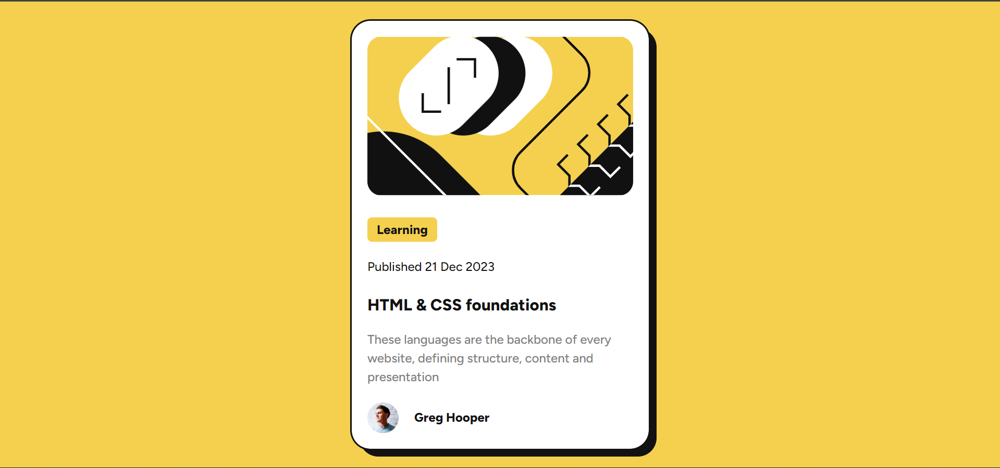

# Frontend Mentor - Blog preview card solution

This is a solution to the [Blog preview card challenge on Frontend Mentor](https://www.frontendmentor.io/challenges/blog-preview-card-ckPaj01IcS). Frontend Mentor challenges help you improve your coding skills by building realistic projects.

## Table of contents

- [Overview](#overview)
  - [The challenge](#the-challenge)
  - [Screenshot](#screenshot)
  - [Links](#links)
- [My process](#my-process)
  - [Built with](#built-with)
  - [What I learned](#what-i-learned)
  - [Continued development](#continued-development)
  - [Useful resources](#useful-resources)
- [Author](#author)
- [Acknowledgments](#acknowledgments)

## Overview

### The challenge

Users should be able to:

- See hover and focus states for all interactive elements on the page

### Screenshot

### Links

- Solution URL: [Add solution URL here](https://github.com/ayeniDan/blog-preview-card-main)
- Live Site URL: [Add live site URL here](https://blog-preview-card-main-rouge.vercel.app/)

## My process

### Built with

- Semantic HTML5 markup
- CSS
- Flexbox
- Desktop-first workflow

### Continued development

I improved my knowledge on flexbox. I had issues with with `align-items: center` only to releaize it was a problem with `margin-bottom`

# Author

- Frontend Mentor - [@ayeniDan](https://www.frontendmentor.io/profile/ayeniDan)
- Facebook - [Daniel Ayeni](https://web.facebook.com/profile.php?id=61555029605626)
